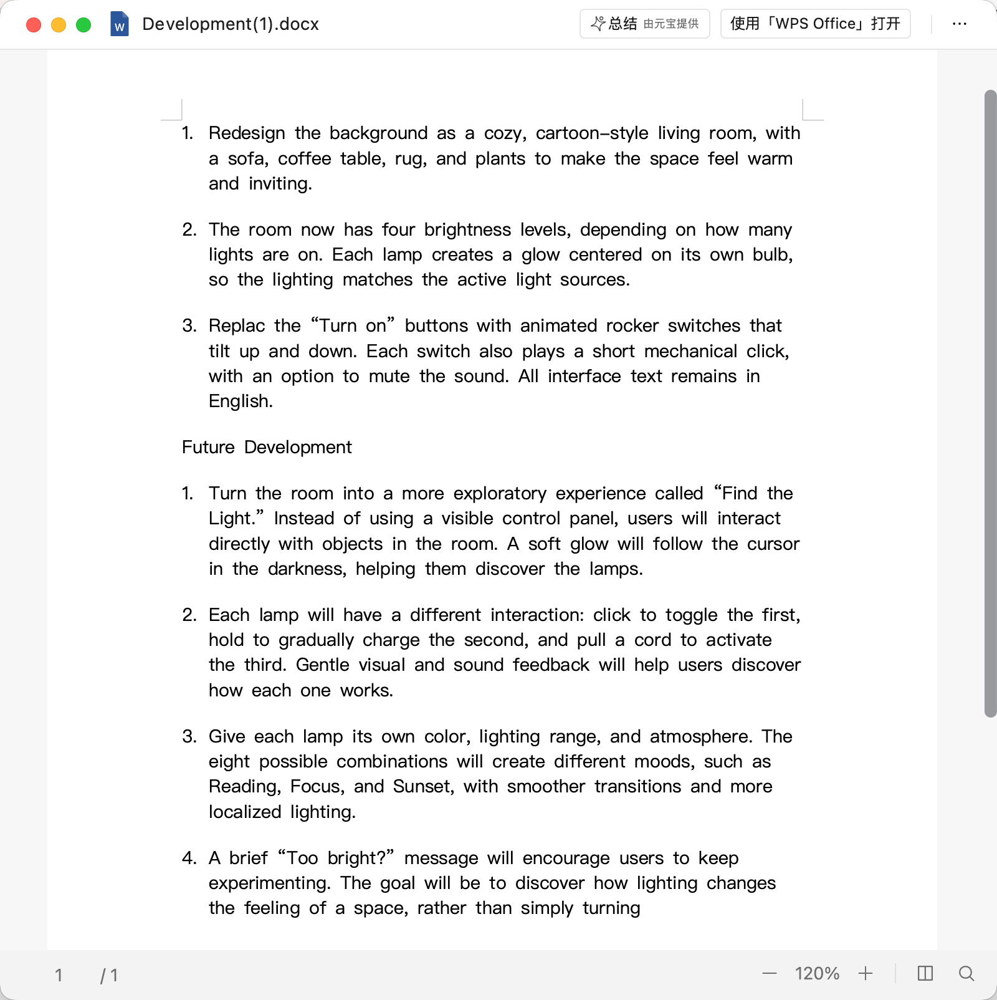
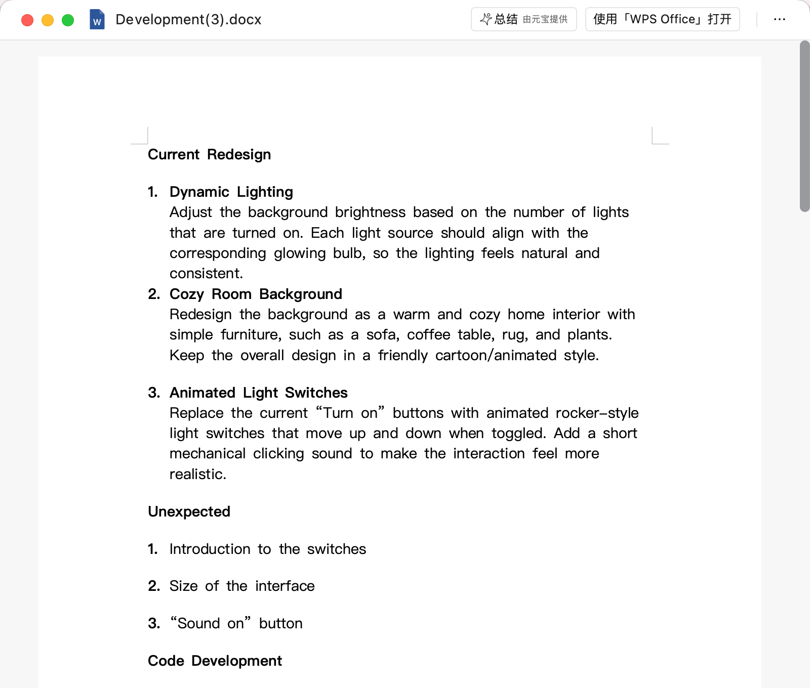
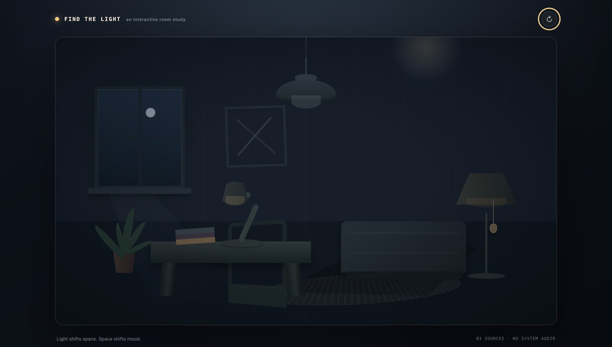
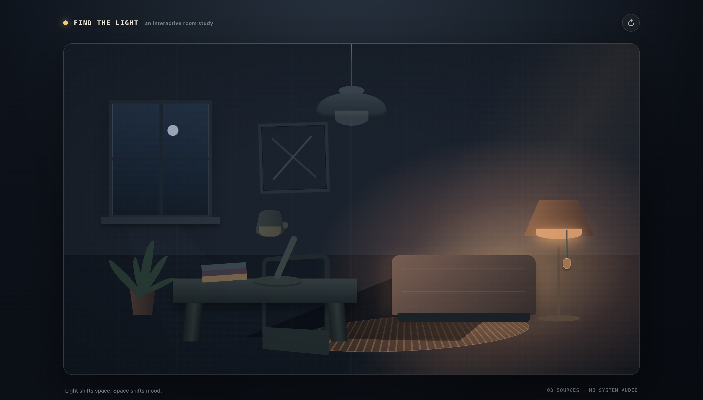
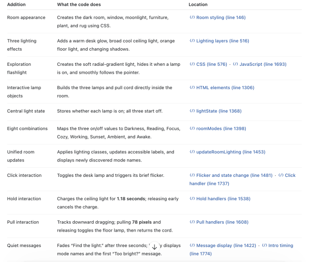
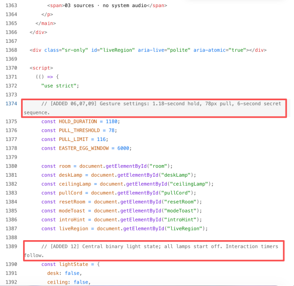
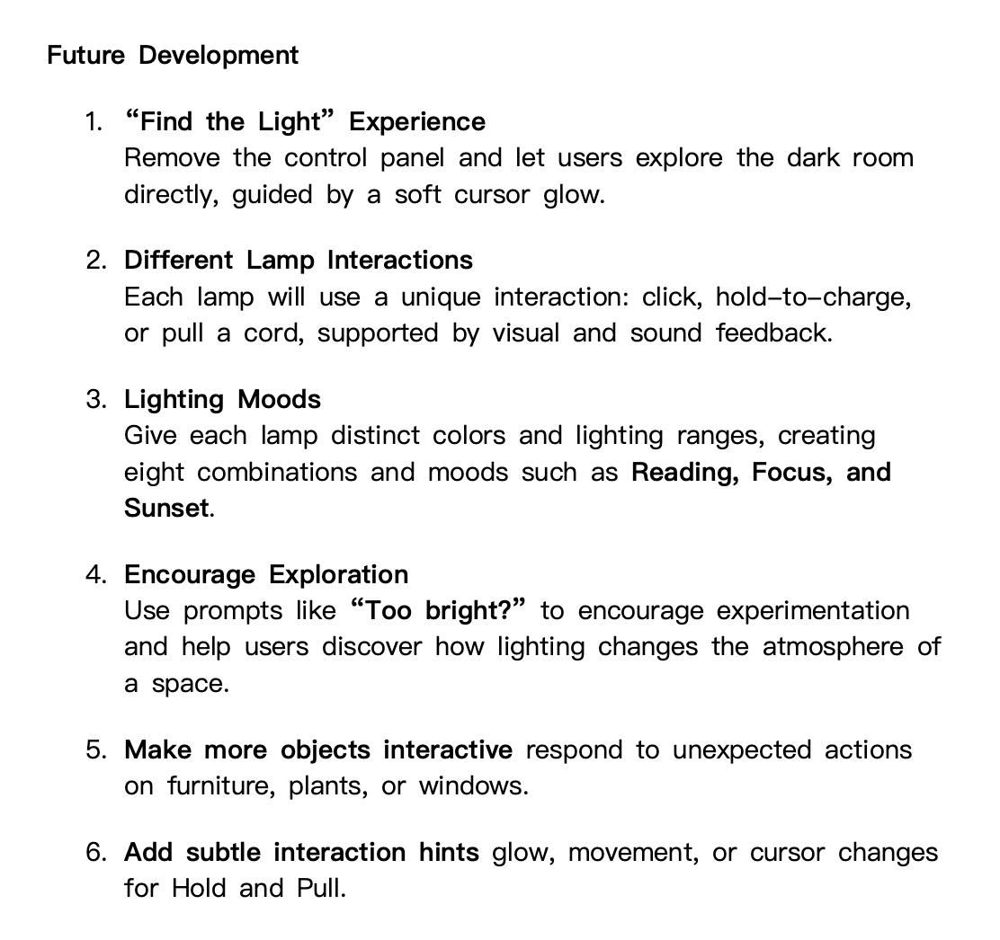

# Find the Light 💡

**Find the Light** is a small interactive web experience that explores creative ways of interacting with light and space.

The project began with a simple room containing three lights. Instead of keeping three identical switches, I gradually redesigned the experience so that users could discover different ways to interact with each light.

---

## Step 1 — Describe

The original scene contained three lights in a dark room.

At the beginning:

- all three lights are off;
- the room is dark;
- turning on any light illuminates the room.

The goal was not simply to create three switches, but to make the room more **playful, interactive, and exploratory**.

<details>
<summary>Screenshot 1 — My design plan</summary>



> **When someone explores the dark room, the experience should encourage them to discover how each light works through interaction and visual feedback.**

My final interaction plan was:

- **Desk lamp:** click
- **Ceiling lamp:** press and hold
- **Floor lamp:** pull the cord

</details>

## Step 2 — Work with AI

I used **Codex** throughout the project to generate ideas, write HTML/CSS/JavaScript, compare alternatives, and revise the interaction design.

My first redesign focused on:

- a warmer cartoon-style room;
- dynamic brightness depending on how many lights were on;
- animated light switches;
- simple sound feedback.

These selected prompts preserve important decisions from the brief and conversation. Chinese excerpts are followed by English translations.

| Prompt or exchange | What it helped me direct or understand |
| --- | --- |
| “用户应该直接与房间中的物体互动。” — “Users should interact directly with objects in the room.” | Replace the separate control panel with interactive lamps inside the scene. |
| “松开过早则灯光逐渐熄灭。” — “If released too early, the light gradually fades.” | Define the difference between temporary feedback and a completed action. |
| “直接根据这个prompt生成项目” — “Generate the project directly from this prompt.” | Turn the detailed design brief into a browser-based implementation. |
| “can you show me the changed code in the original html, just highlight the related code” | Locate relevant changes in the source rather than only describe the result. |
| “show me the difference just in code level (html, css, js)” | Separate the structure, visual styling, and interaction logic. |

## Step 3 — Test and Revise

### What I expected

The room should start dark but remain explorable. Clicking, holding, or pulling should produce feedback that matches the action. A cancelled gesture should not switch on a lamp, and a message should describe the room's current state. Different lamp combinations should change the atmosphere, not simply make everything uniformly brighter.

### What the development notes revealed

My earlier redesign notes listed dynamic lighting, a cozy room, and animated switches. They also recorded unexpected interface text, the size of the interface, and a “Sound on” button. The accompanying classroom notes mention background sizing problems in some groups. These are earlier design/classroom observations, not verified failures of this repository's current build. The current project has no audio or sound button.

<details>
<summary>Screenshot 4 — Earlier redesign and unexpected details</summary>



This screenshot preserves the earlier comparison rather than presenting those features as the current implementation.

</details>

### What actually happened in the room

The two screenshots below show the dark room and a floor-lamp-on state. In the first, the furniture and lamp outlines remain visible even though the lamps are off. In the second, the floor lamp creates a warm orange glow around the chair and rug while the desk and ceiling lamps remain dim. This matches the intended contrast between darkness and localized lighting.



*Room screenshot A — Dark room, saved September 26 at 01:29:43.*



*Room screenshot B — Floor lamp on, saved September 26 at 01:31:36. These are two lighting states, not before-and-after code versions. A still image does not demonstrate the pull distance, hold timing, or cancellation behavior.*

### Using a code map to understand the result

I explored explanations in code blocks, a line-numbered guide, and comments inside the original HTML file. I chose a **code map** supported by inline annotations: a table connects each feature to what the code does and where to find it. This made it easier to trace an idea such as “hold to charge” to its timing, feedback, and event handlers.



*Screenshot 2 — A saved code map from the AI-assisted explanation process. Its line numbers refer to that earlier version and may differ from the current file.*



*Screenshot 3 — Inline comments identifying the 1.18-second hold, 78-pixel pull, and central lamp state. These are explanatory annotations, not a Git before-and-after diff.*

In the current [index.html](index.html), search for `ADDED 06` to follow the ceiling lamp across CSS, HTML, and JavaScript; `ADDED 07` follows the pull cord; `ADDED 12` identifies the shared lamp state and room updates. `REVISED` marks the later interruption and delayed-feedback fixes.

### Debugging and retesting the current code

Codex ran the actual inline JavaScript with a simulated document, input events, and clock. On September 25, the initial checks had **7 passes and 6 failures**. After the following revisions, the same **13 tests passed**. The current repository was checked again on September 26: **13 passed, 0 failed**. These are automated logic checks, not my own browser play-test.

| Situation tested | Expected behavior | Observed before the fix | Revision and retest |
| --- | --- | --- | --- |
| Start a keyboard hold, then move focus, blur the window, or hide the document. | Cancel the unfinished charge. | The ceiling lamp still turned on. | Added cancellation for the three interruptions. All three tests pass and a new hold can start. |
| Receive repeated Space keydown events. | Keep charging without allowing the default key action. | Repeated events were not prevented. | Prevent defaults on every activation-key event; start only on the initial press. Test passes. |
| Lose pointer capture after pulling beyond the threshold. | Cancel an interrupted pull. | The floor lamp toggled as though release were intentional. | Treat lost capture as cancellation. Test passes. |
| Turn all lights on, then turn one off before “Too bright?” appears. | Do not show an outdated question. | The delayed question still appeared. | Cancel the pending timer, recheck the state, and count the question as seen only when displayed. Cancellation and later rediscovery pass. |

The other checks cover desk toggles, short and completed holds, pull thresholds, all eight lighting combinations, and resetting pending interactions or messages. The `lightState` object stores three on/off values, while `updateRoomLighting()` derives the room's appearance from them. Keeping a temporary charge preview separate from that committed state is an important implementation choice.

Run the checks with Node.js 18 or later from the project folder:

```sh
node tests/interactions.test.cjs
```

See the [test source](tests/interactions.test.cjs) and [saved retest output](evidence/test-results.txt). Node is needed only for these checks, not to open the experience.

### Further hands-on checks

The room screenshots document the visible dark and floor-lit states. The automated tests document logic separately. Neither establishes every gesture's usability, so the following checks remain to be recorded rather than being marked complete:

- [ ] Open the room and compare a short ceiling press with a full hold. Note whether the ring communicates progress clearly.
- [ ] Try a short pull and a full pull; check that only the full pull toggles the floor lamp.
- [ ] Interrupt a keyboard hold by moving focus, and try again afterward.
- [ ] Turn all lamps on, quickly turn one off, and check for outdated feedback. Try reset during a gesture.
- [ ] Try a small screen and keyboard-only use. Record the device, expected result, actual result, and any remaining problem; a short recording could show the gesture timing that the existing screenshots cannot.

### Remaining problems and next experiments

My plan also proposed interactive furniture, plants, and windows. Those objects remain decorative. Hold and pull already have visual hints, including a charge ring and a glowing cord threshold, but I have not established whether a first-time user understands them. A useful next experiment is to watch someone explore without explaining the gestures, then adjust the hints based on where they hesitate.

Sound remains unimplemented. CSS reduced-motion styling exists, but the JavaScript cursor easing still runs. The automated checks do not establish screen-reader usability or real touch behavior. These limitations remain open rather than being treated as successful test results.

<details>
<summary>Screenshot 5 — Ideas for further exploration</summary>



Direct lamp interaction, lighting combinations, and visual hints are present in the current code. Sound and interaction with other room objects are still proposals.

</details>

## Step 4 — Reflection

My intention was to make turning on lights feel playful and exploratory. My screenshots show a dark but visible room and the floor lamp's warm glow around the chair and rug, which matches my goal of changing the atmosphere through localized light. The current code also gives the lamps distinct gestures. Some ideas in my plan are still incomplete: the furniture and window do not respond to interaction, and sound is absent. The debugging process showed a mismatch between the intended behavior and the first implementation: a keyboard hold could continue after focus moved away, and “Too bright?” could appear after a light was already off. Revising interruption handling and checking the current lighting state made the behavior more consistent with the user's action. The automated tests now pass, but they do not tell me whether a new user will understand the hold and pull gestures; that remains a question for hands-on testing.

AI helped me generate the implementation and examine the relationship between HTML, CSS, and JavaScript. Asking it to explain changes through a code map and inline comments was especially useful: I could connect a visible effect to a named section of code rather than only accept the finished page. I still needed to choose the experience I wanted and judge whether extra details supported exploration. The interruption fixes also gave me a concrete behavior to review rather than assuming the generated code was correct. My main lesson is to document intentions and write prompts with observable behavior, then compare the result with those intentions. A detailed prompt gives AI direction, but it does not replace testing or my responsibility to question the output. My next step is to check the subtle hints with another person and record what they actually do before deciding whether to add more interactive objects.

## Evidence and files

Five process screenshots were extracted unchanged from my supplied **find the light.docx**. Two additional room screenshots were copied unchanged from the desktop captures I supplied. Together, they document the plan, code explanation, and visible room states; they are not generated mockups or a video demonstration. See [screenshot provenance](screenshots/README.md) for the image list.

- [index.html](index.html) — the complete browser experience.
- [tests/interactions.test.cjs](tests/interactions.test.cjs) — repeatable simulated interaction tests.
- [evidence/test-results.txt](evidence/test-results.txt) — saved output from the September 26 retest.
- [screenshots/](screenshots/) — five process screenshots and two room screenshots.

For Canvas, submit [this personal repository](https://github.com/Wanqi777/find-the-light). If repository visibility changes to private, grant the teaching team access before submitting.
